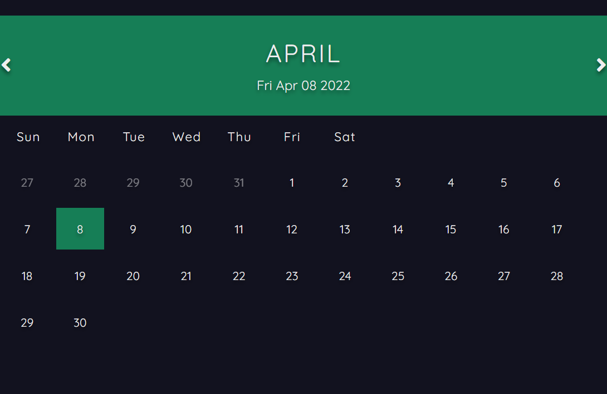

# HTML CSS and JavaScript Calender
Dynamic Calender formatted with HTML and CSS that displays the current date using javascript

# Overview

# What I Learned
+ Creating javascript functions to display all the month's dates on the calender  
+ Formatting elements with HTML and using font awesome icons
+ Styling with CSS including font, element layout
